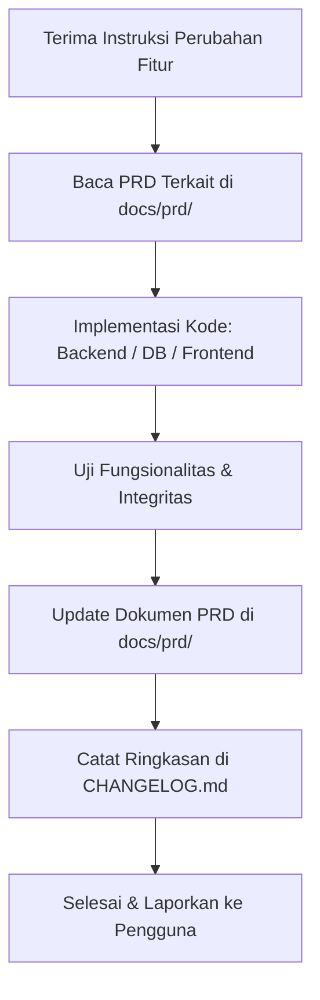

# Panduan Kerja Agen AI & Pengembang: Standar Sinkronisasi PRD

> **PERATURAN WAJIB (MANDATORY POLICY):**  
> Setiap kali terjadi **penambahan fitur**, **perubahan fitur (modifikasi)**, atau **pengurangan/penghapusan fitur (deprecate/remove)** pada aplikasi, file PRD terkait di direktori `docs/prd/` **HARUS DIUPDATE SECARA BERSAMAAN**. Kode tidak boleh diserahkan atau dianggap selesai sebelum dokumen PRD diperbarui.

---

## 1. Prinsip Utama Pemeliharaan PRD

1. **Dokumentasi Selalu Sinkron dengan Kode (Living Document):**
   - PRD bukan dokumen arsip mati, melainkan kontrak fungsional dan teknis yang hidup mencerminkan status terkini aplikasi di branch utama.
   - Tidak diperkenankan membuat fitur tanpa mencatat spesifikasi, skema database, rute endpoint, dan interaksi UI/UX-nya di dalam PRD terkait.

2. **Modular Berdasarkan Domain Fungsional:**
   - PRD dipecah berdasarkan domain fitur ke dalam file-file spesifik di bawah `docs/prd/`.
   - Jangan pernah menggabungkan semua fungsionalitas ke dalam satu file tunggal yang raksasa. Jika ada modul atau domain baru yang independen, buat berkas baru dengan format nomor urut: `docs/prd/[nomor]-[nama-fungsional].md`.

3. **Keamanan & Kerahasiaan Dokumen:**
   - Seluruh folder `docs/` diproteksi dari akses web langsung (HTTP) via `docs/.htaccess` (`Require all denied`) dan aturan penolakan rewrite di root `.htaccess`.
   - Jangan pernah menghapus konfigurasi proteksi akses web pada folder `docs/`.

---

## 2. Alur Kerja (Workflow) Setiap Task Pengembang / AI Agent

Setiap sesi pengembangan atau perbaikan fitur harus mematuhi siklus berikut:



### Langkah 1: Eksplorasi & Membaca PRD Terkait
- Sebelum menulis kode, periksa file PRD yang relevan di folder `docs/prd/` untuk memahami:
  - Alur bisnis dan aturan validasi yang berlaku.
  - Relasi tabel database dan pemetaan akun jurnal (akuntansi).
  - Hak akses (role/permissions) yang diizinkan.

### Langkah 2: Implementasi & Pengujian
- Lakukan penulisan kode sesuai standar arsitektur:
  - Database: pastikan migrasi SQL tercatat dan konsisten.
  - Backend/API: pastikan ada validasi input, sanitasi, proteksi CSRF, dan pengecekan role/permission.
  - Jurnal Akuntansi: jika transaksi mempengaruhi keuangan/stok, pastikan transaksi double-entry balance dan menggunakan helper `create_journal_entry` / `add_journal_line` / `update_general_ledger`.
  - Frontend: pastikan UI responsif, error handling jelas, dan mendukung mode SPA jika diperlukan.

### Langkah 3: Update Dokumen PRD
Segera setelah kode diubah, perbarui berkas PRD yang sesuai:
- **Jika ada penambahan fitur:**
  - Tambahkan subbab baru di file modul terkait: deskripsi fitur, use case, alur kerja (workflow), parameter API (request & response), struktur tabel/kolom baru, dan aturan bisnis.
- **Jika ada modifikasi fitur:**
  - Sesuaikan alur lama dengan yang baru.
  - Berikan tanda riwayat perubahan atau catatan kompatibilitas.
- **Jika ada pengurangan/penghapusan fitur:**
  - Tandai status sebagai *Deprecated* atau hapus bagian tersebut dan catat alasan penghapusannya.
- **Jika membuat modul besar baru:**
  - Buat berkas baru di `docs/prd/` (misal: `13-modul-nama-fitur.md`).
  - Daftarkan berkas baru tersebut pada [docs/README.md](file:///d:/laragon/www/smkn5-toko/docs/README.md) dan [00-arsitektur-dan-standar-sistem.md](file:///d:/laragon/www/smkn5-toko/docs/prd/00-arsitektur-dan-standar-sistem.md).

### Langkah 4: Pembaruan CHANGELOG.md
- Perbarui [CHANGELOG.md](file:///d:/laragon/www/smkn5-toko/CHANGELOG.md) di root project untuk mencatat versi, tanggal rilis, kategori perubahan (`FITUR BARU`, `PENINGKATAN`, `PERBAIKAN BUG`, `PENGHAPUSAN`).

---

## 3. Struktur Direktori Dokumentasi

```
docs/
├── .htaccess                           <- Proteksi pemblokiran akses web langsung
├── AGENTS.md                           <- Dokumen panduan dan aturan operasional ini
├── README.md                           <- Daftar isi, ringkasan arsitektur, dan navigasi PRD
└── prd/
    ├── 00-arsitektur-dan-standar-sistem.md   <- Arsitektur sistem, database, security, akuntansi
    ├── 01-autentikasi-dan-manajemen-pengguna.md <- Auth, users, roles, RBAC, activity log
    ├── 02-master-data-dan-pengaturan.md     <- COA, Saldo awal, Supplier, Settings, Anggaran
    ├── 03-modul-pos-penjualan-dan-kasir.md  <- Kasir POS, Barcode, Multi-pembayaran, Struk, Void
    ├── 04-modul-pembelian-dan-pengadaan.md  <- Pembelian stok, hutang supplier, HPP, cetak/ekspor
    ├── 05-modul-konsinyasi.md               <- Barang titipan, margin komisi, pelunasan vendor
    ├── 06-modul-stok-dan-inventaris.md      <- Katalog barang, kartu stok, opname multi-user, ABC, Aset
    ├── 07-modul-wajib-belanja-wb.md         <- Simpanan belanja, top-up, auto piutang, rekap tahunan
    ├── 08-modul-simpan-pinjam-ksp.md        <- Simpanan, pinjaman, angsuran, poin, agunan, kesehatan
    ├── 09-portal-anggota-pwa.md             <- Mobile web PWA anggota, cek saldo, riwayat, OneSignal
    ├── 10-modul-akuntansi-dan-buku-besar.md <- Engine jurnal, GL, buku besar, neraca saldo, tutup buku
    ├── 11-modul-laporan-keuangan-dan-analitik.md <- Laba rugi, neraca, arus kas, margin, audit saldo
    └── 12-tools-rekonsiliasi-dan-pemeliharaan.md <- Recurring, rekonsiliasi bank, audit transaksi, backup
```

---

## 4. Standar Format Penulisan PRD

Setiap berkas PRD di `docs/prd/` harus mencakup elemen-elemen berikut:
1. **Identitas Dokumen:** Judul modul, versi dokumen, tanggal pembaruan terakhir, status (Active/Draft/Deprecated).
2. **Ringkasan Eksekutif & Tujuan Bisnis:** Mengapa modul ini ada dan masalah apa yang diselesaikannya.
3. **Pengguna & Hak Akses (RBAC):** Siapa saja peran yang diizinkan mengakses/memanipulasi data di modul ini.
4. **Alur Kerja & Proses Bisnis (Workflow Diagram):** Alur langkah demi langkah dengan diagram Mermaid atau list terstruktur.
5. **Spesifikasi Rute & Endpoint API:**
   - Method (`GET`, `POST`, `PUT`, `DELETE`).
   - URL Path.
   - Payload Request (JSON / Form Data) beserta validasinya.
   - Response Payload (Success & Error contract).
6. **Spesifikasi Basis Data (Data Model):**
   - Nama tabel terkait, tipe data, indeks, dan relasi foreign key.
7. **Integrasi Akuntansi (Bila Berdampak Finansial):**
   - Aturan pendebitan dan pengkreditan akun COA (Double-Entry Bookkeeping).
8. **Edge Cases & Error Handling:** Antisipasi kegagalan, validasi stok minus, rollback transaksi database, dan pesan kesalahan bagi pengguna.
