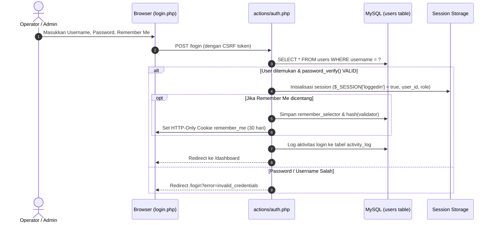

# PRD 01: Modul Autentikasi & Manajemen Pengguna (RBAC)

| Atribut Dokumen | Informasi |
|:---|:---|
| **Modul** | Autentikasi, Manajemen Pengguna & Hak Akses (RBAC) |
| **Versi Dokumen** | 2.1.0 |
| **Tanggal Efektif** | 2026-10-02 |
| **Status** | Active / Production Standard |

---

## 1. Ringkasan Eksekutif & Tujuan

Modul ini bertanggung jawab atas gerbang keamanan seluruh sistem, verifikasi identitas operator backoffice (Admin, Kasir, Pengurus), pemisahan peran dan wewenang (Role-Based Access Control / RBAC), pencatatan jejak audit (Activity Log), serta manajemen profil pengguna.

---

## 2. Pengguna & Peran (Roles)

| Peran (Role) | Deskripsi & Lingkup Wewenang |
|:---|:---|
| **Admin / Superadmin** | Memiliki akses tak terbatas ke seluruh modul: konfigurasi sistem, bagan akun (COA), audit saldo, manajemen user, role permissions, tutup buku, dan laporan keuangan. |
| **Kasir (POS)** | Akses operasional harian: Penjualan POS, cetak struk, penerimaan setoran Wajib Belanja (WB), dan melihat laporan harian kasir. |
| **Petugas Gudang / Stok** | Akses ke modul Pembelian stok masuk, stok opname multi-user, katalog barang, dan laporan persediaan. |
| **Pengurus KSP** | Akses ke modul Simpan Pinjam, persetujuan penarikan, approval pinjaman anggota, dan pengumuman. |
| **Anggota (Member)** | Akses terpisah via portal mandiri `/member/login` untuk cek saldo simpanan, riwayat belanja, dan pengajuan pinjaman online. |

---

## 3. Alur Kerja (Workflow) Autentikasi

### 3.1. Login Operator Backoffice


### 3.2. Remember Me Cookie Rotation (Keamanan Tinggi)
1. Browser mengirim cookie `remember_me` berformat `selector:validator`.
2. Pada file [includes/bootstrap.php](file:///d:/laragon/www/smkn5-toko/includes/bootstrap.php), sistem menjalankan `attempt_login_with_cookie($selector, $validator)`.
3. Database memvalidasi: `hash_equals(remember_validator_hash, hash('sha256', $validator))`.
4. Jika valid, sistem langsung membuat **selector dan validator baru** (rotasi token) dan memperbarui cookie. Hal ini mencegah penggunaan token curian berulang kali.

---

## 4. Spesifikasi Endpoint & Handler

### 4.1. Endpoint Autentikasi
| Method | URL Path | Handler File | Akses | Keterangan |
|:---|:---|:---|:---|:---|
| `GET` | `/login` | `login.php` | Tamu (`guest`) | Halaman login operator |
| `POST` | `/login` | `actions/auth.php` | Tamu (`guest`) | Memproses kredensial login |
| `GET` | `/logout` | `logout.php` | Login (`auth`) | Menghancurkan session & menghapus cookie |
| `GET` | `/forgot` | `pages/forgot_password.php` | Tamu (`guest`) | Formulir lupa password |
| `POST` | `/actions/forgot_password_action.php` | `actions/forgot_password_action.php` | Tamu (`guest`) | Generate token reset password |
| `GET` | `/reset-password` | `pages/reset_password.php` | Tamu (`guest`) | Formulir set password baru via token |
| `POST` | `/reset-password` | `actions/reset_password_action.php` | Tamu (`guest`) | Eksekusi update password baru |

### 4.2. Endpoint Manajemen Pengguna & Hak Akses
| Method | URL Path | Handler File | Akses | Keterangan |
|:---|:---|:---|:---|:---|
| `GET` | `/users` | `pages/users.php` | `admin` | Tampilan daftar pengguna |
| `GET` | `/api/users` | `api/users_handler.php` | `admin` | Mengambil data pengguna dalam format JSON |
| `POST` | `/api/users` | `api/users_handler.php` | `admin` | Tambah / edit / nonaktifkan pengguna |
| `GET` | `/roles` | `pages/roles.php` | `admin` | Tampilan matriks role & permission |
| `POST` | `/roles` | `pages/roles.php` | `admin` | Simpan relasi role terhadap menu & permission |
| `POST` | `/api/my-profile/change-password` | `api/my_profile_handler.php` | `auth` | Ubah kata sandi profil diri sendiri |
| `GET` | `/activity-log` | `pages/activity_log.php` | `admin` | Halaman riwayat audit log |
| `GET` | `/api/activity-log` | `api/activity_log_handler.php` | `admin` | Data audit log dengan filter tanggal & user |

---

## 5. Struktur Basis Data (Data Model)

### 5.1. Tabel `users`
```sql
CREATE TABLE `users` (
  `id` int(11) NOT NULL AUTO_INCREMENT,
  `username` varchar(50) NOT NULL,
  `password` varchar(255) NOT NULL,
  `nama_lengkap` varchar(100) DEFAULT NULL,
  `role` enum('admin','user') NOT NULL DEFAULT 'user',
  `role_id` int(11) DEFAULT NULL,
  `remember_selector` varchar(32) DEFAULT NULL,
  `remember_validator_hash` varchar(64) DEFAULT NULL,
  `status` enum('aktif','nonaktif') NOT NULL DEFAULT 'aktif',
  `created_at` timestamp NOT NULL DEFAULT current_timestamp(),
  PRIMARY KEY (`id`),
  UNIQUE KEY `username` (`username`)
) ENGINE=InnoDB DEFAULT CHARSET=utf8mb4;
```

### 5.2. Tabel RBAC: `roles`, `permissions`, `role_permissions`, `role_menus`
- `roles`: `id`, `name`, `description`
- `permissions`: `id`, `name`, `module`, `description`
- `role_permissions`: `role_id`, `permission_id` (Many-to-Many)
- `role_menus`: `role_id`, `menu_key` (Menentukan menu apa saja di `config/menus.php` yang tampil di sidebar pengguna).

### 5.3. Tabel `activity_log`
```sql
CREATE TABLE `activity_log` (
  `id` int(11) NOT NULL AUTO_INCREMENT,
  `user_id` int(11) DEFAULT NULL,
  `action` varchar(50) NOT NULL,
  `description` text DEFAULT NULL,
  `ip_address` varchar(45) DEFAULT NULL,
  `user_agent` varchar(255) DEFAULT NULL,
  `created_at` timestamp NOT NULL DEFAULT current_timestamp(),
  PRIMARY KEY (`id`),
  KEY `user_id` (`user_id`)
) ENGINE=InnoDB DEFAULT CHARSET=utf8mb4;
```

---

## 6. Aturan Bisnis & Validasi

1. **Kompleksitas Password:** Password minimal 6 karakter dan wajib di-hash menggunakan algoritma `PASSWORD_BCRYPT`.
2. **Perlindungan Akun Admin Utama:** User ID 1 (superadmin default) tidak boleh dihapus atau dinonaktifkan oleh pengguna mana pun untuk mencegah penguncian sistem (system lockout).
3. **Pencatatan Audit Otomatis:** Setiap operasi kritis (Tambah Barang, Update Saldo Awal, Finalisasi Opname, Tutup Buku, Void Transaksi) wajib memanggil helper `log_activity($action, $description)`.
4. **Isolasi Sesi Member & Admin:** Sesi operator backoffice (`$_SESSION['loggedin']`) dan sesi anggota portal (`$_SESSION['member_loggedin']`) dipisahkan secara ketat agar anggota tidak dapat mengakses rute backoffice.
