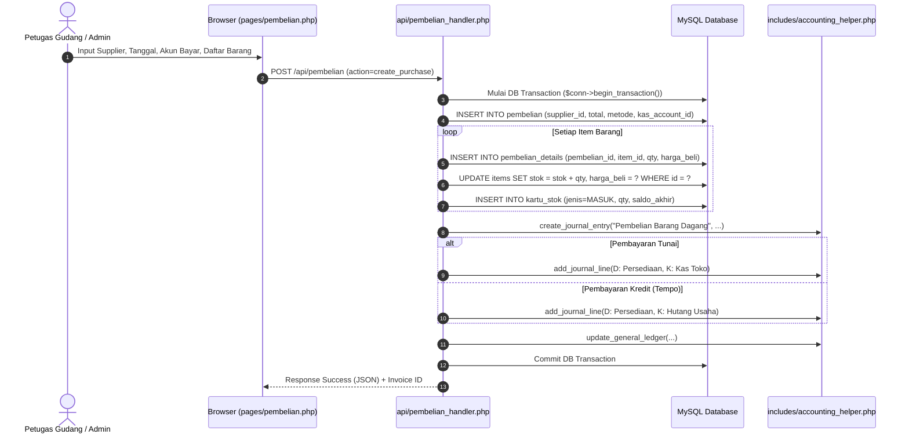

# PRD 04: Modul Pembelian & Pengadaan Stok

| Atribut Dokumen | Informasi |
|:---|:---|
| **Modul** | Pembelian Barang Dagang & Manajemen Pengadaan |
| **Versi Dokumen** | 2.1.0 |
| **Tanggal Efektif** | 2026-10-02 |
| **Status** | Active / Production Standard |

---

## 1. Ringkasan Eksekutif & Tujuan

Modul Pembelian mengelola rantai pasok pengadaan barang ritel koperasi sekolah dari berbagai distributor dan supplier. Modul ini memastikan pencatatan harga beli modal (HPP) akurat, penambahan kuantitas stok otomatis ke kartu stok, serta pencatatan kewajiban hutang dagang atau kas keluar ke dalam pembukuan akuntansi.

---

## 2. Fitur Utama

1. **Pencatatan Pembelian Multi-Item:**
   - Input faktur pembelian dari supplier lengkap dengan nomor faktur, tanggal nota, dan jatuh tempo.
   - Pilihan supplier terdaftar atau input supplier langsung.
   - Penambahan baris barang dengan harga beli satuan, kuantitas beli, dan subtotal.
2. **Otomasi Pembaruan Stok & Harga Beli Terakhir:**
   - Secara otomatis menambah stok barang pada tabel `items`.
   - Memperbarui kolom harga beli modal (`harga_beli`) sebagai acuan HPP terbaru.
   - Menuliskan mutasi penambahan ke tabel `kartu_stok` (Tipe: `MASUK`).
3. **Metode Pembayaran Pembelian:**
   - **Tunai (Kas/Bank):** Mengeluarkan dana langsung dari akun Kas Toko atau Rekening Bank.
   - **Kredit / Tempo (Hutang Usaha):** Mencatat kewajiban pada akun Hutang Usaha / Hutang Dagang dengan tanggal jatuh tempo.
4. **Laporan & Histori Pembelian Lengkap:**
   - Filter histori pengadaan berdasarkan rentang tanggal, nama supplier, dan status pembayaran.
   - Fitur ekspor laporan ke format **PDF resmi** dan **CSV Spreadsheet** untuk rekonsiliasi data pengadaan.

---

## 3. Alur Kerja (Workflow) Pembelian



---

## 4. Mekanisme Jurnal Akuntansi

### Contoh Transaksi:
- Pembelian ATK & Snack dari Distributor "CV Berkah Jaya": Total **Rp 2.500.000**.
- Syarat Pembayaran: Tunai **Rp 1.000.000**, Sisa Kredit/Tempo **Rp 1.500.000**.

### Jurnal Otomatis yang Terbentuk:
```
(D) Persediaan Barang Dagang (Akun 1-1301)   Rp 2.500.000
    (K) Kas Toko (Akun 1-1101)                            Rp 1.000.000
    (K) Hutang Usaha / Dagang (Akun 2-1101)               Rp 1.500.000
```

---

## 5. Spesifikasi Rute & Endpoint API

| Method | URL Path | Handler File | Hak Akses | Deskripsi |
|:---|:---|:---|:---|:---|
| `GET` | `/pembelian` | `pages/pembelian.php` | `auth` | Halaman form input transaksi pembelian |
| `GET` | `/api/pembelian` | `api/pembelian_handler.php` | `auth` | Mengambil daftar riwayat pembelian dan supplier |
| `POST` | `/api/pembelian` | `api/pembelian_handler.php` | `auth` | Simpan transaksi pembelian baru / pelunasan hutang |
| `GET` | `/laporan-pembelian` | `pages/laporan_pembelian.php` | `auth` | Tampilan laporan pembelian |
| `GET` | `/api/laporan-pembelian` | `api/laporan_pembelian_handler.php` | `auth` | Data JSON laporan pembelian terfilter |
| `POST` | `/api/pdf` | `api/laporan_cetak_handler.php` | `auth` | Cetak laporan pembelian PDF (via POST aman) |
| `GET` | `/api/csv?report=pembelian` | `api/laporan_cetak_csv_handler.php` | `auth` | Ekspor rekapitulasi pembelian CSV |

---

## 6. Struktur Basis Data (Data Model)

### 6.1. Tabel `pembelian`
```sql
CREATE TABLE `pembelian` (
  `id` int(11) NOT NULL AUTO_INCREMENT,
  `user_id` int(11) NOT NULL,
  `nomor_faktur` varchar(50) NOT NULL,
  `supplier_id` int(11) DEFAULT NULL,
  `tanggal` date NOT NULL,
  `jatuh_tempo` date DEFAULT NULL,
  `total` decimal(15,2) NOT NULL,
  `metode_pembayaran` enum('tunai','kredit') NOT NULL DEFAULT 'tunai',
  `status_pembayaran` enum('lunas','belum_lunas') NOT NULL DEFAULT 'lunas',
  `kas_account_id` int(11) DEFAULT NULL,
  `hutang_account_id` int(11) DEFAULT NULL,
  `jurnal_id` int(11) DEFAULT NULL,
  `keterangan` text DEFAULT NULL,
  `created_by` int(11) DEFAULT NULL,
  `created_at` timestamp NOT NULL DEFAULT current_timestamp(),
  PRIMARY KEY (`id`),
  KEY `supplier_id` (`supplier_id`)
) ENGINE=InnoDB DEFAULT CHARSET=utf8mb4;
```

### 6.2. Tabel `pembelian_details`
```sql
CREATE TABLE `pembelian_details` (
  `id` int(11) NOT NULL AUTO_INCREMENT,
  `pembelian_id` int(11) NOT NULL,
  `item_id` int(11) NOT NULL,
  `qty` int(11) NOT NULL,
  `harga_beli` decimal(15,2) NOT NULL,
  `subtotal` decimal(15,2) NOT NULL,
  PRIMARY KEY (`id`),
  KEY `pembelian_id` (`pembelian_id`),
  FOREIGN KEY (`pembelian_id`) REFERENCES `pembelian` (`id`) ON DELETE CASCADE
) ENGINE=InnoDB DEFAULT CHARSET=utf8mb4;
```

---

## 7. Validasi & Penanganan Kondisi Khusus

1. **Pencegahan Kuantitas Nol/Minus:** Setiap baris barang wajib memiliki kuantitas `qty >= 1` dan harga beli `harga_beli >= 0`.
2. **Validasi Akun Kas dan Hutang:** Jika metode pembayaran tunai, sistem mewajibkan pemilihan akun kas yang aktif (`is_kas = 1`). Jika tempo, wajib mengaitkan akun kewajiban hutang dagang.
3. **Pembatalan / Retur:** Jika terjadi penghapusan atau revisi nota pembelian, sistem melakukan reverse stok pada kartu stok dan membuat jurnal pembalik agar nilai saldo persediaan tidak mengalami deviasi.
