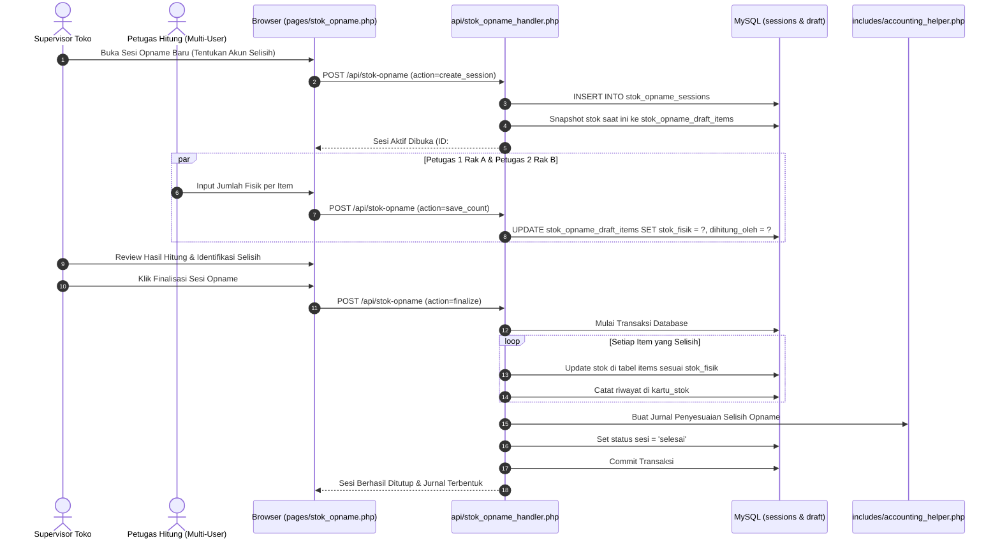

# PRD 06: Modul Stok, Inventaris & Aset Tetap

| Atribut Dokumen | Informasi |
|:---|:---|
| **Modul** | Manajemen Stok, Inventarisasi Multi-User & Aset Tetap |
| **Versi Dokumen** | 2.1.0 |
| **Tanggal Efektif** | 2026-10-02 |
| **Status** | Active / Production Standard |

---

## 1. Ringkasan Eksekutif & Tujuan

Persediaan barang dagang adalah aset lancar terbesar pada koperasi toko sekolah. Modul ini menyediakan kontrol menyeluruh terhadap pergerakan stok secara perpetual, riwayat keluar-masuk (Kartu Stok), proses **Stok Opname Kolaboratif Multi-User Real-time**, analisis klasifikasi perputaran barang (Analisis ABC & Reorder Point), serta pengelolaan Aset Tetap dan kalkulasi penyusutan otomatis.

---

## 2. Fitur Utama

### 2.1. Master Barang & Katalog Stok
- Manajemen data barang: Kode Barcode, SKU, Nama Barang, Kategori, Satuan (Pcs, Box, Pack, dll).
- Penetapan Harga Modal/Beli (`harga_beli`), Harga Jual (`harga_jual`), dan batas Minimum Stok (*reorder threshold*).
- Fitur Impor Data Barang via CSV dengan sinkronisasi otomatis ke Buku Besar Akuntansi (General Ledger).

### 2.2. Kartu Stok Perpetual (Inventory Movement Log)
- Melacak setiap mutasi fisik:
  - `MASUK` (dari Pembelian atau Penyesuaian Lebih).
  - `KELUAR` (dari Penjualan POS atau Penyesuaian Kurang/Rusak).
- Menampilkan saldo awal, kuantitas mutasi, saldo akhir, nomor referensi transaksi, dan petugas yang bertanggung jawab.

### 2.3. Stok Opname Kolaboratif Multi-User (Real-Time Sessions)
- **Sistem Sesi Terbuka:** Supervisor membuka sesi opname baru dengan mengambil *snapshot* stok sistem.
- **Perhitungan Bersama (Multi-Petugas):** Banyak staf/siswa magang dapat menghitung fisik barang secara bersamaan di lorong rak yang berbeda melalui perangkat masing-masing tanpa konflik data.
- **Draft & Verifikasi:** Petugas dapat menyimpan draft perhitungan berkali-kali (`stok_opname_draft_items`) sebelum finalisasi.
- **Finalisasi & Auto-Adjustment Jurnal:** Supervisor memvalidasi hasil akhir:
  - Selisih Kurang (Fisik < Sistem): Otomatis memotong stok dan membukukan `(D) Beban Selisih Opname | (K) Persediaan`.
  - Selisih Lebih (Fisik > Sistem): Otomatis menambah stok dan membukukan `(D) Persediaan | (K) Pendapatan Selisih Opname`.

### 2.4. Analisis ABC & Reorder Point (ROP)
- **Klasifikasi ABC Berdasarkan Nilai Perputaran:**
  - **Kategori A:** Barang bernilai tinggi / perputaran cepat (20% item menghasilkan 80% omzet).
  - **Kategori B:** Barang nilai menengah (30% item menghasilkan 15% omzet).
  - **Kategori C:** Barang lambat / nilai rendah (50% item menghasilkan 5% omzet).
- **Rekomendasi Reorder Stok:** Indikator otomatis kapan barang harus dipesan ulang berdasarkan rata-rata penjualan harian dan lead-time supplier.

### 2.5. Manajemen Aset Tetap & Penyusutan Otomatis
- Pendaftaran aset koperasi: Komputer Kasir, Rak Display, Lemari Pendingin, Kendaraan Operasional.
- Perhitungan metode Garis Lurus (*Straight-Line Depreciation*):
  $$\text{Beban Penyusutan Bulanan} = \frac{\text{Harga Perolehan} - \text{Nilai Residu}}{\text{Masa Manfaat (Tahun)} \times 12}$$
- Eksekusi jurnal penyusutan bulanan otomatis:
  ```
  (D) Beban Penyusutan Aset Tetap
      (K) Akumulasi Penyusutan Aset Tetap
  ```

---

## 3. Alur Kerja (Workflow) Stok Opname Multi-User



---

## 4. Spesifikasi Rute & Endpoint API

| Method | URL Path | Handler File | Hak Akses | Deskripsi |
|:---|:---|:---|:---|:---|
| `GET` | `/stok` | `pages/stok.php` | `auth` | Tampilan katalog barang & stok fisik |
| `GET` | `/api/stok` | `api/stok_handler.php` | `auth` | Mengambil data item, filter kategori, riwayat mutasi |
| `POST` | `/api/stok` | `api/stok_handler.php` | `auth` | Tambah item baru, edit produk, penyesuaian cepat |
| `GET` | `/stok-opname` | `pages/stok_opname.php` | `auth` | Tampilan aplikasi stok opname multi-user |
| `GET` | `/api/stok-opname` | `api/stok_opname_handler.php` | `auth` | Ambil status sesi aktif, draft item, riwayat opname |
| `POST` | `/api/stok-opname` | `api/stok_opname_handler.php` | `auth` | Buka sesi, simpan hitungan item, finalisasi sesi |
| `GET` | `/analisis-stok-reorder` | `pages/analisis_stok_reorder.php` | `auth` | Halaman visualisasi Analisis ABC & ROP |
| `GET` | `/api/analisis-stok-reorder` | `api/analisis_stok_reorder_handler.php` | `auth` | Data JSON kalkulasi turnover barang & saran reorder |
| `GET` | `/aset-tetap` | `pages/aset_tetap.php` | `auth` | Halaman inventaris aset tetap & depresiasi |
| `GET` | `/api/aset_tetap` | `api/aset_tetap_handler.php` | `auth` | Ambil daftar aset dan jadwal penyusutan |
| `POST` | `/api/aset_tetap` | `api/aset_tetap_handler.php` | `admin` | Tambah aset baru / jalankan depresiasi bulanan |

---

## 5. Struktur Basis Data (Data Model)

### 5.1. Tabel `items`
```sql
CREATE TABLE `items` (
  `id` int(11) NOT NULL AUTO_INCREMENT,
  `user_id` int(11) NOT NULL,
  `barcode` varchar(50) DEFAULT NULL,
  `sku` varchar(50) NOT NULL,
  `nama_barang` varchar(100) NOT NULL,
  `kategori_id` int(11) DEFAULT NULL,
  `satuan` varchar(20) NOT NULL DEFAULT 'Pcs',
  `harga_beli` decimal(15,2) NOT NULL DEFAULT 0.00,
  `harga_jual` decimal(15,2) NOT NULL DEFAULT 0.00,
  `stok` int(11) NOT NULL DEFAULT 0,
  `stok_minimum` int(11) NOT NULL DEFAULT 5,
  `track_stock` tinyint(1) NOT NULL DEFAULT 1,
  `status` enum('aktif','nonaktif') NOT NULL DEFAULT 'aktif',
  `created_at` timestamp NOT NULL DEFAULT current_timestamp(),
  `updated_at` timestamp NOT NULL DEFAULT current_timestamp() ON UPDATE current_timestamp(),
  PRIMARY KEY (`id`),
  UNIQUE KEY `uk_sku` (`user_id`,`sku`),
  KEY `barcode` (`barcode`)
) ENGINE=InnoDB DEFAULT CHARSET=utf8mb4;
```

### 5.2. Tabel `kartu_stok`
```sql
CREATE TABLE `kartu_stok` (
  `id` int(11) NOT NULL AUTO_INCREMENT,
  `user_id` int(11) NOT NULL,
  `item_id` int(11) NOT NULL,
  `tanggal` datetime NOT NULL,
  `jenis_transaksi` varchar(50) NOT NULL COMMENT 'PENJUALAN, PEMBELIAN, OPNAME, RETUR',
  `nomor_referensi` varchar(50) DEFAULT NULL,
  `masuk` int(11) NOT NULL DEFAULT 0,
  `keluar` int(11) NOT NULL DEFAULT 0,
  `saldo_akhir` int(11) NOT NULL,
  `keterangan` text DEFAULT NULL,
  `created_by` int(11) DEFAULT NULL,
  PRIMARY KEY (`id`),
  KEY `item_id` (`item_id`),
  KEY `tanggal` (`tanggal`)
) ENGINE=InnoDB DEFAULT CHARSET=utf8mb4;
```

### 5.3. Tabel `stok_opname_sessions` & `stok_opname_draft_items`
```sql
CREATE TABLE `stok_opname_sessions` (
  `id` INT AUTO_INCREMENT PRIMARY KEY,
  `user_id` INT NOT NULL,
  `created_by` INT NOT NULL,
  `tanggal` DATE NOT NULL,
  `keterangan` VARCHAR(255) NOT NULL,
  `adj_account_id` INT NOT NULL COMMENT 'Beban Selisih Opname',
  `income_account_id` INT NULL COMMENT 'Pendapatan Selisih Opname',
  `status` ENUM('aktif','selesai') NOT NULL DEFAULT 'aktif',
  `finalized_by` INT NULL,
  `finalized_at` DATETIME NULL,
  `created_at` DATETIME NOT NULL DEFAULT CURRENT_TIMESTAMP
) ENGINE=InnoDB DEFAULT CHARSET=utf8mb4;

CREATE TABLE `stok_opname_draft_items` (
  `id` INT AUTO_INCREMENT PRIMARY KEY,
  `session_id` INT NOT NULL,
  `item_id` INT NOT NULL,
  `stok_sistem` INT NOT NULL,
  `stok_fisik` INT NULL,
  `dihitung_oleh` INT NULL,
  `dihitung_at` DATETIME NULL,
  UNIQUE KEY `uk_session_item` (`session_id`, `item_id`),
  INDEX `idx_session_id` (`session_id`)
) ENGINE=InnoDB DEFAULT CHARSET=utf8mb4;
```

---

## 6. Validasi & Pengendalian Integritas

1. **Snapshot Isolation pada Stok Opname:** Stok sistem di-freeze pada saat sesi dibuka sehingga transaksi kasir yang berlangsung selama proses penghitungan fisik tidak merusak akurasi selisih.
2. **Kewajiban Log Kartu Stok:** Tidak ada pembaruan stok di tabel `items` yang boleh dieksekusi tanpa menyisipkan baris log mutasi di tabel `kartu_stok`.
3. **Penyusutan Nilai Buku:** Nilai buku aset tetap tidak boleh bernilai negatif atau menyusut melebihi nilai perolehan dikurangi nilai residu.
