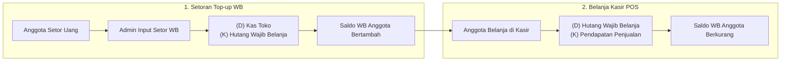

# PRD 07: Modul Wajib Belanja (WB) & Loyalitas Anggota

| Atribut Dokumen | Informasi |
|:---|:---|
| **Modul** | Wajib Belanja (WB) Anggota, Rekapitulasi & Leaderboard |
| **Versi Dokumen** | 2.1.0 |
| **Tanggal Efektif** | 2026-10-02 |
| **Status** | Active / Production Standard |

---

## 1. Konsep Bisnis & Definisi Wajib Belanja (WB)

**Wajib Belanja (WB)** adalah instrumen khas koperasi sekolah/konsumen untuk mendorong partisipasi aktif anggota dalam memajukan toko koperasi. Setiap anggota (guru, staf, atau siswa) memiliki kuota komitmen belanja bulanan yang disetorkan di muka sebagai saldo simpanan belanja.

### Karakteristik Finansial WB:
- **Setoran WB (Top-up):** Merupakan **titipan dana / liabilitas koperasi** (Hutang WB kepada Anggota), bukan pendapatan toko.
- **Penggunaan di Kasir:** Saldo WB berfungsi sebagai alat bayar non-tunai resmi di kasir POS. Saat dibelanjakan, kewajiban koperasi berkurang dan toko mengakui pendapatan penjualan.
- **Transparansi & Pembagian SHU:** Akumulasi transaksi belanja anggota sepanjang tahun menjadi salah satu dasar utama perhitungan pembagian Sisa Hasil Usaha (SHU) berdasarkan jasa usaha anggota.

---

## 2. Fitur Utama

1. **Penerimaan Setoran Wajib Belanja:**
   - Input setoran tunai atau transfer dari anggota.
   - Pilihan periode bulan tagihan yang dibayarkan.
   - Cetak kuitansi / bukti tanda terima setoran WB.
   - Pengkreditan instan ke saldo WB anggota.
2. **Pembayaran Belanja via Saldo WB di Kasir:**
   - Kasir memilih anggota; sistem menampilkan sisa saldo WB aktif.
   - Pemotongan saldo otomatis sesuai total belanja.
   - **Auto-Detect Kurang Bayar:** Jika saldo WB tidak mencukupi dan anggota tidak menambah tunai, selisihnya secara otomatis dicatat sebagai **Piutang Anggota** terstruktur.
3. **Laporan Rekapitulasi WB Tahunan:**
   - Tabel matriks tahunan menampilkan kontribusi setoran anggota bulan per bulan (Januari s/d Desember).
   - Indikator status kepatuhan anggota (Lunas / Menunggak).
   - Modal interaktif riwayat transaksi lengkap dengan rincian item belanja dan metode pembayaran.
4. **Member Leaderboard (Papan Peringkat Belanja):**
   - Pemeringkatan anggota paling loyal berdasarkan total nominal belanja dan frekuensi transaksi.
   - **Drill-down Riwayat Transaksi:** Klik nama anggota menampilkan modal riwayat belanja dengan tab *Riwayat Belanja* dan *Wajib Belanja*, lengkap dengan rincian item barang yang dibeli per transaksi.

---

## 3. Alur Kerja (Workflow) & Jurnal Akuntansi



### Jurnal Akuntansi Rinci:

#### A. Saat Anggota Menyetor WB Sebesar Rp 100.000:
```
(D) Kas Toko (Akun 1-1101)                 Rp 100.000
    (K) Hutang Wajib Belanja (Akun 2-1301)            Rp 100.000
```

#### B. Saat Anggota Belanja Sebesar Rp 65.000 Menggunakan Saldo WB:
```
(D) Hutang Wajib Belanja (Akun 2-1301)      Rp 65.000
    (K) Pendapatan Penjualan (Akun 4-1101)            Rp 65.000

(D) Harga Pokok Penjualan (HPP)             Rp 48.000
    (K) Persediaan Barang Dagang                      Rp 48.000
```

---

## 4. Spesifikasi Rute & Endpoint API

| Method | URL Path | Handler File | Hak Akses | Deskripsi |
|:---|:---|:---|:---|:---|
| `GET` | `/wajib-belanja` | `pages/wajib_belanja.php` | `auth` | Halaman transaksi setor & pantauan WB |
| `GET` | `/api/wajib-belanja` | `api/wajib_belanja_handler.php` | `auth` | Riwayat setoran WB dan cek saldo anggota |
| `POST` | `/api/wajib-belanja` | `api/wajib_belanja_handler.php` | `auth` | Simpan transaksi setoran WB baru |
| `GET` | `/laporan-wb-tahunan` | `pages/laporan_wb_tahunan.php` | `auth` | Tampilan rekapitulasi WB 12 bulan |
| `GET` | `/api/laporan-wb-tahunan` | `api/laporan_wb_tahunan_handler.php` | `auth` | Data matriks tahunan dan modal detail belanja |
| `GET` | `/leaderboard` | `pages/leaderboard.php` | `auth` | Halaman peringkat member belanja |
| `GET` | `/api/leaderboard` | `api/leaderboard_handler.php` | `auth` | Data peringkat dan rincian transaksi drill-down |

---

## 5. Struktur Basis Data (Data Model)

### 5.1. Tabel `transaksi_wajib_belanja`
```sql
CREATE TABLE `transaksi_wajib_belanja` (
  `id` int(11) NOT NULL AUTO_INCREMENT,
  `user_id` int(11) NOT NULL,
  `anggota_id` int(11) NOT NULL,
  `tanggal` date NOT NULL,
  `tahun` int(4) NOT NULL,
  `bulan` int(2) NOT NULL,
  `jumlah` decimal(15,2) NOT NULL,
  `jenis` enum('setor','belanja') NOT NULL DEFAULT 'setor',
  `kas_account_id` int(11) DEFAULT NULL,
  `penjualan_id` int(11) DEFAULT NULL,
  `jurnal_id` int(11) DEFAULT NULL,
  `keterangan` text DEFAULT NULL,
  `created_by` int(11) DEFAULT NULL,
  `created_at` timestamp NOT NULL DEFAULT current_timestamp(),
  PRIMARY KEY (`id`),
  KEY `anggota_id` (`anggota_id`),
  KEY `penjualan_id` (`penjualan_id`),
  FOREIGN KEY (`anggota_id`) REFERENCES `anggota` (`id`) ON DELETE CASCADE
) ENGINE=InnoDB DEFAULT CHARSET=utf8mb4;
```

---

## 6. Validasi & Integritas Saldo

1. **Integritas Saldo Non-Negatif:** Saldo WB pada tabel `anggota.saldo_wb` tidak boleh bernilai minus melalui transaksi kasir biasa. Jika total belanja lebih besar dari saldo, kelebihan nominal wajib dialihkan ke tunai atau dicatat pada kolom `nominal_piutang`.
2. **Sinkronisasi Otomatis Anggota Baru:** Pendaftaran anggota baru atau proses sinkronisasi dari aplikasi simpan pinjam eksternal secara otomatis menginisialisasi baris kepatuhan WB tahun berjalan.
3. **Pemberian Reward Gamifikasi:** Setiap penyetoran WB tepat waktu sebelum tanggal 10 setiap bulan dapat memberikan poin gamifikasi loyalitas tambahan kepada anggota secara otomatis.
