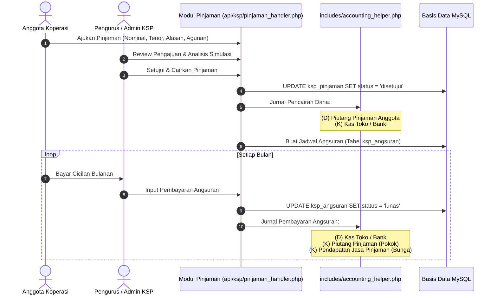

# PRD 08: Modul Koperasi Simpan Pinjam (KSP)

| Atribut Dokumen | Informasi |
|:---|:---|
| **Modul** | Unit Simpan Pinjam Koperasi (KSP) & Layanan Anggota |
| **Versi Dokumen** | 2.1.0 |
| **Tanggal Efektif** | 2026-10-02 |
| **Status** | Active / Production Standard |

---

## 1. Ringkasan Eksekutif & Tujuan

Selain mengoperasikan toko ritel, koperasi mengelola unit simpan pinjam untuk memfasilitasi kebutuhan finansial anggota (guru, tenaga kependidikan, dan siswa). Modul KSP menangani pendaftaran keanggotaan lengkap dengan NIK, transaksi simpanan (Pokok, Wajib, Sukarela), persetujuan penarikan simpanan, pengajuan kredit pinjaman, agunan, pelunasan angsuran, simulasi kredit, serta rasio kesehatan koperasi.

---

## 2. Fitur Utama

### 2.1. Manajemen Anggota & Sinkronisasi
- Pendaftaran anggota baru dengan atribut lengkap: Nomor Anggota, NIK (Nomor Induk Kependudukan), Nama Lengkap, Kategori (Guru/Staf/Siswa), Nomor HP/WhatsApp, Alamat, dan Rekening Bank.
- **Fitur Sinkronisasi Cerdas (Sync SP):** Mengimpor data anggota otomatis dari database Simpan Pinjam eksternal dengan mode *New Data Only* (mencegah data lokal tertimpa).

### 2.2. Manajemen Simpanan
- **Jenis Simpanan:**
  - **Simpanan Pokok:** Dibayar sekali saat awal bergabung sebagai anggota (Ekuitas Koperasi).
  - **Simpanan Wajib:** Dibayar rutin setiap bulan (Ekuitas / Liabilitas Jangka Panjang).
  - **Simpanan Sukarela:** Tabungan fleksibel yang dapat disetor dan ditarik sewaktu-waktu.
- **Workflow Penarikan Simpanan Sukarela:**
  - Pengajuan penarikan oleh anggota (via portal mobile atau kasir).
  - Verifikasi saldo mencukupi dan *approval* oleh pengurus/admin koperasi.
  - Pencairan dana kas/transfer dan otomatis mendebit rekening simpanan.

### 2.3. Manajemen Pinjaman & Angsuran Kredit
- **Pengajuan Pinjaman:** Pemilihan jenis kredit, nominal pinjaman, suku bunga bulanan (% flat/menurun), tenor cicilan (bulan), dan agunan/jaminan.
- **Simulasi Kredit Interaktif:** Menghitung tabel amortisasi angsuran pokok, bunga/jasa, dan total cicilan bulanan sebelum pengajuan disetujui.
- **Pencairan Pinjaman (Disbursement):** Mengeluarkan dana kas/bank ke anggota dan mencatat saldo Piutang Pinjaman.
- **Pembayaran Angsuran:** Anggota mencicil setiap bulan. Sistem memisahkan secara akurat porsi pengembalian Pokok Pinjaman dan Pendapatan Jasa Bunga Koperasi.

### 2.4. Fitur Pelengkap & Loyalitas
- **Laporan Nominatif Simpanan & Pinjaman:** Rekap saldo seluruh anggota per tanggal tertentu untuk audit berkala.
- **Poin & Reward (Gamifikasi):** Pemberian poin atas kedisiplinan setor simpanan, belanja di toko, dan membayar angsuran tepat waktu (`ksp_gamification_log`).
- **Wishlist Barang Anggota:** Fitur usulan pengadaan barang toko oleh anggota.
- **Pengumuman KSP & Notifikasi:** Pengumuman rapat anggota tahunan (RAT) dan broadcast pemberitahuan.
- **Generate QR Bayar:** Pembuatan QR statis/dinamis untuk pembayaran setoran anggota.

---

## 3. Alur Kerja (Workflow) Pinjaman & Jurnal Akuntansi



---

## 4. Spesifikasi Rute & Endpoint API

| Method | URL Path | Handler File | Hak Akses | Deskripsi |
|:---|:---|:---|:---|:---|
| `GET` | `/anggota` / `/ksp/anggota` | `pages/ksp/anggota.php` | `auth` | Halaman daftar dan pendaftaran anggota |
| `GET` | `/api/ksp/anggota` | `api/ksp/anggota_handler.php` | `auth` | Ambil data anggota, pencarian NIK/Nama |
| `POST` | `/api/ksp/anggota` | `api/ksp/anggota_handler.php` | `auth` | Simpan anggota baru, edit, sync dari SP app |
| `GET` | `/ksp/simpanan` | `pages/ksp/simpanan.php` | `auth` | Halaman transaksi simpanan |
| `POST` | `/api/ksp/simpanan` | `api/ksp/simpanan_handler.php` | `auth` | Eksekusi setoran simpanan anggota |
| `GET` | `/ksp/penarikan` | `pages/ksp/penarikan.php` | `auth` | Halaman persetujuan penarikan sukarela |
| `POST` | `/api/ksp/penarikan` | `api/ksp/penarikan_handler.php` | `auth` | Approve / tolak penarikan simpanan |
| `GET` | `/ksp/pinjaman` | `pages/ksp/pinjaman.php` | `auth` | Halaman manajemen pengajuan & angsuran pinjaman |
| `POST` | `/api/ksp/pinjaman` | `api/ksp/pinjaman_handler.php` | `auth` | Pengajuan, persetujuan, pencairan, bayar angsuran |
| `GET` | `/ksp/simulasi` | `pages/ksp/simulasi.php` | `auth` | Kalkulator simulasi kredit pinjaman |
| `GET` | `/ksp/laporan-nominatif` | `pages/ksp/laporan_nominatif.php` | `auth` | Laporan saldo nominatif simpanan/pinjaman |
| `GET` | `/ksp/laporan-simpanan` | `pages/ksp/laporan_simpanan.php` | `auth` | Laporan mutasi simpanan per periode |
| `GET` | `/ksp/laporan-pinjaman` | `pages/ksp/laporan_pinjaman.php` | `auth` | Laporan kredit, kolektibilitas, sisa pokok |
| `GET` | `/ksp/statistik` | `pages/ksp/statistik.php` | `auth` | Metrik statistik & tren simpan pinjam |

---

## 5. Struktur Basis Data (Data Model)

### 5.1. Tabel `anggota`
```sql
CREATE TABLE `anggota` (
  `id` int(11) NOT NULL AUTO_INCREMENT,
  `user_id` int(11) NOT NULL,
  `nomor_anggota` varchar(30) NOT NULL,
  `nik` varchar(20) DEFAULT NULL,
  `nama_lengkap` varchar(100) NOT NULL,
  `kategori` enum('guru','staf','siswa','umum') NOT NULL DEFAULT 'guru',
  `telepon` varchar(20) DEFAULT NULL,
  `email` varchar(100) DEFAULT NULL,
  `alamat` text DEFAULT NULL,
  `saldo_wb` decimal(15,2) NOT NULL DEFAULT 0.00,
  `saldo_simpanan` decimal(15,2) NOT NULL DEFAULT 0.00,
  `gamification_points` int(11) NOT NULL DEFAULT 0,
  `password` varchar(255) DEFAULT NULL,
  `status` enum('aktif','nonaktif') NOT NULL DEFAULT 'aktif',
  `created_at` timestamp NOT NULL DEFAULT current_timestamp(),
  PRIMARY KEY (`id`),
  UNIQUE KEY `nomor_anggota` (`nomor_anggota`),
  KEY `nik` (`nik`)
) ENGINE=InnoDB DEFAULT CHARSET=utf8mb4;
```

### 5.2. Tabel `ksp_pinjaman` & `ksp_angsuran`
```sql
CREATE TABLE `ksp_pinjaman` (
  `id` int(11) NOT NULL AUTO_INCREMENT,
  `anggota_id` int(11) NOT NULL,
  `nomor_pinjaman` varchar(50) NOT NULL,
  `tanggal_pengajuan` date NOT NULL,
  `jumlah_pinjaman` decimal(15,2) NOT NULL,
  `tenor_bulan` int(11) NOT NULL,
  `bunga_persen` decimal(5,2) NOT NULL,
  `total_bunga` decimal(15,2) NOT NULL,
  `angsuran_pokok` decimal(15,2) NOT NULL,
  `angsuran_bunga` decimal(15,2) NOT NULL,
  `total_angsuran_bulanan` decimal(15,2) NOT NULL,
  `sisa_pokok` decimal(15,2) NOT NULL,
  `status` enum('menunggu','disetujui','ditolak','lunas') NOT NULL DEFAULT 'menunggu',
  `tanggal_pencairan` date DEFAULT NULL,
  `kas_account_id` int(11) DEFAULT NULL,
  PRIMARY KEY (`id`),
  KEY `anggota_id` (`anggota_id`),
  FOREIGN KEY (`anggota_id`) REFERENCES `anggota` (`id`) ON DELETE CASCADE
) ENGINE=InnoDB DEFAULT CHARSET=utf8mb4;

CREATE TABLE `ksp_angsuran` (
  `id` int(11) NOT NULL AUTO_INCREMENT,
  `pinjaman_id` int(11) NOT NULL,
  `angsuran_ke` int(11) NOT NULL,
  `jatuh_tempo` date NOT NULL,
  `pokok` decimal(15,2) NOT NULL,
  `bunga` decimal(15,2) NOT NULL,
  `total_bayar` decimal(15,2) NOT NULL,
  `status` enum('belum_bayar','lunas') NOT NULL DEFAULT 'belum_bayar',
  `tanggal_bayar` datetime DEFAULT NULL,
  PRIMARY KEY (`id`),
  KEY `pinjaman_id` (`pinjaman_id`),
  FOREIGN KEY (`pinjaman_id`) REFERENCES `ksp_pinjaman` (`id`) ON DELETE CASCADE
) ENGINE=InnoDB DEFAULT CHARSET=utf8mb4;
```

---

## 6. Validasi Bisnis & Kontrol Keuangan

1. **Batas Maksimal Plafon Pinjaman:** Anggota tidak diperkenankan mengajukan pinjaman baru jika pinjaman sebelumnya masih berstatus belum lunas dan sisa pokok pinjaman melebihi batas batas ketentuan AD/ART koperasi.
2. **Pemisahan Akuntansi Pokok & Jasa:** Pendapatan jasa pinjaman (bunga) wajib diakui terpisah dari pengembalian pokok agar laporan Laba Rugi koperasi mencerminkan pendapatan operasional yang sebenarnya.
3. **Pemberian Gamifikasi Terukur:** Setiap penambahan poin menggunakan fungsi aman `addGamificationPoints($member_id, $type, $points)` yang otomatis mencatat log di `ksp_gamification_log`.
