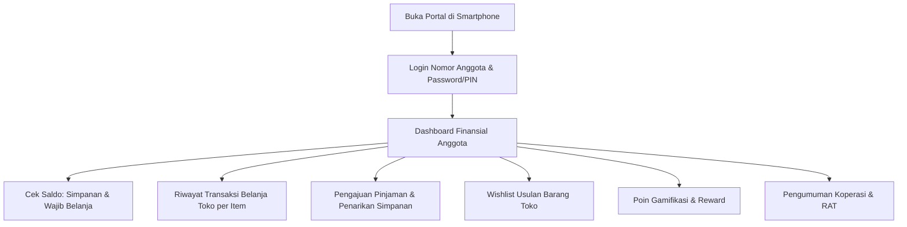

# PRD 09: Modul Portal Anggota PWA (Mobile-First)

| Atribut Dokumen | Informasi |
|:---|:---|
| **Modul** | Portal Layanan Mandiri Anggota & Progressive Web App (PWA) |
| **Versi Dokumen** | 2.1.0 |
| **Tanggal Efektif** | 2026-10-02 |
| **Status** | Active / Production Standard |

---

## 1. Ringkasan Eksekutif & Karakteristik Desain

Portal Anggota adalah antarmuka mandiri (*self-service*) berbasis **Progressive Web App (PWA)** dengan pendekatan desain *Mobile-First*. Aplikasi ini memungkinkan setiap anggota koperasi (guru, karyawan, dan siswa) mengakses informasi finansial mereka secara real-time langsung melalui smartphone tanpa perlu mengunduh aplikasi native dari Play Store / App Store.

### Fitur PWA Utama:
- **Web App Manifest (`manifest.json`):** Memungkinkan anggota menginstal aplikasi ke beranda (*Add to Home Screen*) selayaknya aplikasi native.
- **Service Worker (`service-worker.js`):** Caching aset statis (CSS, JS, Font, Logo) untuk pengalaman memuat kilat (*instant load*).
- **Push Notification OneSignal (`OneSignalSDK.sw.js`):** Pemberitahuan instan saat setoran diverifikasi, saat pengajuan pinjaman disetujui, atau promosi barang toko baru.

---

## 2. Fitur-Fitur Portal Anggota

1. **Dashboard Finansial Transparan:**
   - Ringkasan Saldo Wajib Belanja (WB) yang siap dipakai belanja di kasir toko.
   - Total Saldo Simpanan (Pokok, Wajib, Sukarela).
   - Status Pinjaman Aktif & Jatuh Tempo Angsuran Terdekat.
   - Poin Gamifikasi & Tingkat Loyalitas (Bronze, Silver, Gold).
2. **Rincian Riwayat Transaksi Belanja Toko:**
   - Anggota dapat melihat histori struk belanja kasir mereka.
   - Menampilkan tanggal belanja, kasir yang melayani, metode bayar (Tunai / Saldo WB / Piutang), serta **rincian nama barang, kuantitas, dan harga satuan**.
3. **Layanan Finansial Mandiri (Self-Service):**
   - **Ajukan Penarikan Simpanan Sukarela:** Anggota menginput nominal yang ingin ditarik dan nomor rekening tujuan.
   - **Ajukan Pinjaman Baru:** Memilih tenor dan nominal pinjaman lengkap dengan estimasi angsuran bulanan.
4. **Wishlist Pengadaan Barang Toko:**
   - Anggota dapat mengusulkan produk atau jajanan yang mereka inginkan agar disediakan di rak toko koperasi.
5. **Pengaturan Akun & Profil:**
   - Mengubah kata sandi atau PIN keamanan.
   - Memperbarui nomor telepon WhatsApp dan informasi profil.

---

## 3. Spesifikasi Rute & Endpoint API

| Method | URL Path | Handler File | Hak Akses | Deskripsi |
|:---|:---|:---|:---|:---|
| `GET` | `/member/login` | `member_login.php` | Publik | Halaman login portal mobile anggota |
| `POST` | `/api/member/login` | `api/ksp/member_auth.php` | Publik | Otentikasi nomor anggota & kata sandi |
| `GET` | `/member/dashboard` | `pages/ksp/member_dashboard.php` | Sesi Member | Tampilan aplikasi dashboard mobile PWA |
| `GET` | `/member/logout` | Router Closure | Sesi Member | Logout dan hapus sesi anggota |
| `GET` | `/api/member/dashboard` | `api/ksp/member_dashboard_handler.php` | Sesi Member | Data JSON saldo, riwayat belanja, pinjaman |
| `POST` | `/api/member/dashboard` | `api/ksp/member_dashboard_handler.php` | Sesi Member | Submit pengajuan pinjaman / penarikan / wishlist |
| `POST` | `/api/member/profile` | `api/ksp/member_profile_handler.php` | Sesi Member | Update kata sandi atau profil anggota |

---

## 4. Keamanan & Isolasi Sesi

1. **Pemisahan Sesi Sempurna:**
   - Portal anggota menggunakan penanda sesi khusus: `$_SESSION['member_loggedin'] = true` dan `$_SESSION['member_id']`.
   - Anggota yang telah login ke portal **tidak dapat** mengakses rute backoffice (`/dashboard`, `/stok`, `/penjualan`, `/settings`), karena rute backoffice mensyaratkan `$_SESSION['loggedin'] = true` dengan role yang valid.
2. **Perlindungan Data Antar Anggota (Data Privacy):**
   - Seluruh query di `api/ksp/member_dashboard_handler.php` mewajibkan klausa `WHERE anggota_id = ?` yang diambil langsung dari ID sesi aktif, bukan dari parameter request GET/POST untuk mencegah kebocoran data (*IDOR mitigation*).
3. **Pemberitahuan Push Real-Time:**
   - Saat pengurus menyetujui pengajuan pinjaman di backoffice, sistem memicu helper `send_push_notification()` melalui OneSignal API ke ID perangkat anggota terkait.

---

## 5. Antarmuka Pengguna & Responsivitas Mobile

- Desain dioptimalkan untuk ukuran layar ponsel pintar (`max-width: 480px`, margin auto, shadow lembut).
- Navigasi bawah (*Bottom Navigation Bar*) khas aplikasi native untuk berpindah antara Beranda, Transaksi Belanja, Layanan Finansial, dan Akun Saya.
- Visual indikator status berwarna (Hijau untuk disetujui, Kuning untuk diproses, Merah untuk jatuh tempo/ditolak).
