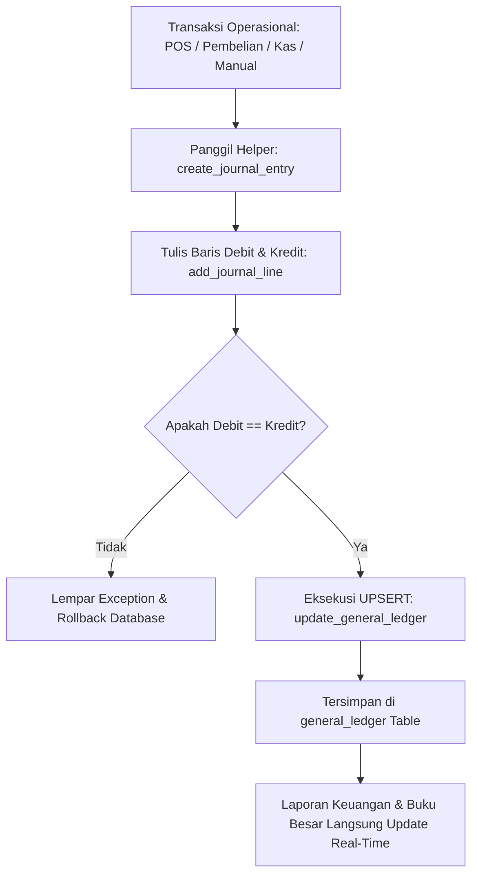

# PRD 10: Modul Akuntansi, Jurnal & Buku Besar (General Ledger)

| Atribut Dokumen | Informasi |
|:---|:---|
| **Modul** | Core Akuntansi, Entri Jurnal, Buku Besar & Tutup Buku |
| **Versi Dokumen** | 2.1.0 |
| **Tanggal Efektif** | 2026-10-02 |
| **Status** | Active / Production Standard |

---

## 1. Ringkasan Eksekutif & Karakteristik Arsitektur

Modul Akuntansi adalah *central engine* keuangan dari seluruh ekosistem aplikasi Koperasi & Toko SMKN 5. Seluruh modul operasional (POS, Pembelian, Konsinyasi, Wajib Belanja, Simpan Pinjam, dan Aset Tetap) bermuara pada pencatatan akuntansi berpasangan (*double-entry*) di modul ini.

### Keunggulan Arsitektur:
1. **Denormalisasi General Ledger untuk Kecepatan Ekstrem:**  
   Selain mencatat jurnal detail di `jurnal_entries` dan `jurnal_details`, sistem memperbarui tabel agregat `general_ledger` menggunakan teknik **UPSERT** (`INSERT ... ON DUPLICATE KEY UPDATE`). Hal ini membuat pembuatan laporan Buku Besar, Neraca Saldo, dan Laba Rugi ribuan transaksi dapat dihitung dalam hitungan milidetik.
2. **Standardisasi API Jurnal:**  
   Disediakan helper terpadu di [includes/accounting_helper.php](file:///d:/laragon/www/smkn5-toko/includes/accounting_helper.php) (`create_journal_entry`, `add_journal_line`, dan `update_general_ledger`).
3. **Mekanisme Tutup Buku Aman (Period Closing):**  
   Penguncian transaksi historis mencegah manipulasi data masa lalu dan secara otomatis memindahkan saldo laba bersih berjalan ke akun Ekuitas: Laba Ditahan (*Retained Earnings*).

---

## 2. Fitur Utama

1. **Entri Jurnal Manual / Penyesuaian (Adjusting Entries):**
   - Fasilitas bagi bagian akuntansi untuk mencatat transaksi non-kasir, penyesuaian beban akrual, biaya dibayar di muka, atau koreksi kesalahan pembukuan.
   - **Validasi Keseimbangan Real-Time:** Tombol simpan terkunci otomatis jika $\sum \text{Debit} \neq \sum \text{Kredit}$.
2. **Daftar Jurnal Terkelompok (Journal Explorer):**
   - Menampilkan seluruh jurnal transaksi yang dikelompokkan rapi per nomor transaksi.
   - Dilengkapi badge kategori warna-warni (Penjualan, Pembelian, Kas, Jurnal Umum, Void).
   - Tombol pintas filter cepat: *Hari Ini*, *Bulan Ini*, atau rentang kustom.
   - Menampilkan jam dan menit detail untuk memudahkan pelacakan audit.
3. **Buku Besar Interaktif (General Ledger Drill-Down):**
   - Pemilihan akun COA untuk melihat mutasi debit, kredit, dan saldo berjalan (*running balance*).
   - Fitur klik baris untuk melakukan *drill-down* ke nomor faktur/sumber transaksi asal.
4. **Neraca Saldo & Lajur (Trial Balance):**
   - Menampilkan ringkasan total mutasi debit dan kredit seluruh akun COA dalam satu periode.
   - Pengecekan otomatis status keseimbangan (*Balance Indicator*).
5. **Proses Tutup Buku (Closing the Books):**
   - **Tutup Buku Bulanan:** Mengunci seluruh transaksi pada bulan tersebut agar tidak dapat diubah atau dihapus oleh kasir/petugas.
   - **Tutup Buku Tahunan:** Merangkum seluruh akun Pendapatan (Kelas 4) dan Beban (Kelas 5 & 6), menghitung Laba/Rugi Bersih, dan membuat jurnal penutup otomatis yang mengalihkan laba ke akun Laba Ditahan / Cadangan Koperasi.

---

## 3. Alur Kerja (Workflow) Jurnal & General Ledger



---

## 4. Spesifikasi Rute & Endpoint API

| Method | URL Path | Handler File | Hak Akses | Deskripsi |
|:---|:---|:---|:---|:---|
| `GET` | `/entri-jurnal` | `pages/entri_jurnal.php` | `auth` | Halaman form input jurnal umum manual |
| `POST` | `/api/entri-jurnal` | `api/entri_jurnal_handler.php` | `auth` | Simpan jurnal manual (multi baris D/K) |
| `GET` | `/daftar-jurnal` | `pages/daftar_jurnal.php` | `auth` | Tampilan daftar jurnal per transaksi |
| `GET` | `/api/entri-jurnal` | `api/entri_jurnal_handler.php` | `auth` | Data JSON daftar jurnal dengan filter |
| `GET` | `/buku-besar` | `pages/buku_besar.php` | `auth` | Tampilan buku besar per akun |
| `GET` | `/api/buku-besar-data` | `api/buku_besar_data_handler.php` | `auth` | Data mutasi dan running balance akun |
| `GET` | `/neraca-saldo` | `pages/neraca_saldo.php` | `auth` | Tampilan neraca saldo |
| `GET` | `/api/neraca-saldo` | `api/neraca_saldo_handler.php` | `auth` | Data JSON neraca saldo seluruh akun |
| `GET` | `/tutup-buku` | `pages/tutup_buku.php` | `admin` | Halaman kontrol tutup buku periode |
| `GET` | `/api/tutup-buku` | `api/tutup_buku_handler.php` | `admin` | Histori periode tutup buku |
| `POST` | `/api/tutup-buku` | `api/tutup_buku_handler.php` | `admin` | Eksekusi tutup buku & penguncian periode |

---

## 5. Struktur Basis Data (Data Model)

### 5.1. Tabel `jurnal_entries` & `jurnal_details`
```sql
CREATE TABLE `jurnal_entries` (
  `id` int(11) NOT NULL AUTO_INCREMENT,
  `user_id` int(11) NOT NULL,
  `nomor_jurnal` varchar(50) DEFAULT NULL,
  `tanggal` date NOT NULL,
  `keterangan` text NOT NULL,
  `created_by` int(11) DEFAULT NULL,
  `created_at` timestamp NOT NULL DEFAULT current_timestamp(),
  PRIMARY KEY (`id`),
  KEY `tanggal` (`tanggal`)
) ENGINE=InnoDB DEFAULT CHARSET=utf8mb4;

CREATE TABLE `jurnal_details` (
  `id` int(11) NOT NULL AUTO_INCREMENT,
  `jurnal_entry_id` int(11) NOT NULL,
  `account_id` int(11) NOT NULL,
  `debit` decimal(15,2) NOT NULL DEFAULT 0.00,
  `kredit` decimal(15,2) NOT NULL DEFAULT 0.00,
  PRIMARY KEY (`id`),
  KEY `jurnal_entry_id` (`jurnal_entry_id`),
  KEY `account_id` (`account_id`),
  FOREIGN KEY (`jurnal_entry_id`) REFERENCES `jurnal_entries` (`id`) ON DELETE CASCADE,
  FOREIGN KEY (`account_id`) REFERENCES `accounts` (`id`) ON DELETE RESTRICT
) ENGINE=InnoDB DEFAULT CHARSET=utf8mb4;
```

### 5.2. Tabel Rekap Cepat: `general_ledger`
```sql
CREATE TABLE `general_ledger` (
  `id` int(11) NOT NULL AUTO_INCREMENT,
  `user_id` int(11) NOT NULL,
  `account_id` int(11) NOT NULL,
  `tanggal` date NOT NULL,
  `keterangan` text DEFAULT NULL,
  `nomor_referensi` varchar(100) DEFAULT NULL,
  `ref_id` int(11) NOT NULL DEFAULT 0,
  `debit` decimal(15,2) NOT NULL DEFAULT 0.00,
  `kredit` decimal(15,2) NOT NULL DEFAULT 0.00,
  `created_by` int(11) DEFAULT NULL,
  `created_at` timestamp NOT NULL DEFAULT current_timestamp(),
  PRIMARY KEY (`id`),
  KEY `idx_account_tanggal` (`account_id`,`tanggal`)
) ENGINE=InnoDB DEFAULT CHARSET=utf8mb4;
```

---

## 6. Aturan Validasi & Integritas Data

1. **Jurnal Seimbang:** Sistem mutlak menolak penyimpanan entri jurnal jika total debit tidak sama dengan total kredit ($\Delta \neq 0$).
2. **Kunci Periode Tertutup:** Transaksi dengan tanggal transaksi sebelum atau sama dengan tanggal tutup buku terakhir (`closing_date`) secara otomatis diblokir dari aksi `INSERT`, `UPDATE`, maupun `DELETE`.
3. **Pencatatan Jam dan Menit yang Akurat:** Seluruh data jurnal mencatat timestamp presisi hingga ke detik untuk memudahkan pelacakan urutan kronologis kejadian (*audit trail*).
