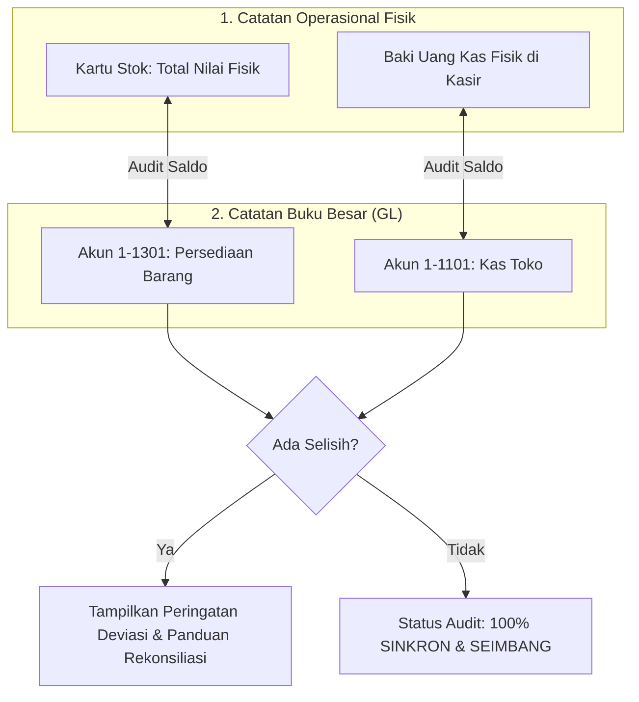

# PRD 11: Modul Laporan Keuangan, Eksekutif & Analitik Bisnis

| Atribut Dokumen | Informasi |
|:---|:---|
| **Modul** | Pusat Laporan Keuangan, Analitik Margin & Rasio Koperasi |
| **Versi Dokumen** | 2.1.0 |
| **Tanggal Efektif** | 2026-10-02 |
| **Status** | Active / Production Standard |

---

## 1. Ringkasan Eksekutif & Tujuan

Modul ini adalah pusat pelaporan eksekutif yang mengubah jutaan baris data transaksi harian menjadi informasi bisnis yang strategis, terstruktur, dan siap saji bagi Pengurus Koperasi, Kepala Sekolah, Komite Sekolah, serta Pengawas. Modul ini mencakup laporan keuangan standar akuntansi (Neraca, Laba Rugi, Arus Kas), analisis margin profitabilitas produk, audit piutang anggota, dan rasio kesehatan finansial.

---

## 2. Cakupan Laporan & Fitur Analitik

### 2.1. Laporan Finansial Standar (SAK ETAP / Koperasi)
1. **Laporan Laba Rugi (Income Statement):**
   - Format standar komersial dan format khusus koperasi (memisahkan partisipasi bruto anggota dan transaksi non-anggota).
   - Menghitung Pendapatan Penjualan, HPP, Laba Kotor, Beban Operasional, Beban Non-Operasional, dan Sisa Hasil Usaha (SHU) / Laba Bersih.
2. **Laporan Posisi Keuangan (Neraca / Balance Sheet):**
   - Aset Lancar (Kas, Bank, Piutang Anggota, Persediaan Barang Dagang).
   - Aset Tetap (Nilai Perolehan dikurangi Akumulasi Penyusutan).
   - Kewajiban Jangka Pendek (Hutang Dagang Supplier, Hutang Wajib Belanja, Hutang Konsinyasi).
   - Ekuitas (Simpanan Pokok, Simpanan Wajib, Cadangan Koperasi, Laba Tahun Berjalan, Laba Ditahan).
3. **Laporan Arus Kas (Cash Flow Statement):**
   - Arus Kas dari Aktivitas Operasi (Penerimaan kasir, setoran WB, pembayaran supplier, bayar operasional).
   - Arus Kas dari Aktivitas Investasi (Pembelian/penjualan aset tetap).
   - Arus Kas dari Aktivitas Pendanaan (Penyetoran simpanan pokok/wajib).
4. **Laporan Perubahan Modal & Laba Ditahan:**
   - Menampilkan pergerakan ekuitas dari awal tahun hingga saldo akhir berjalan.

### 2.2. Laporan Penjualan, Margin & Profitabilitas
1. **Laporan Harian Kasir:**
   - Rekap kas masuk harian per shift kasir, rincian pembayaran tunai vs non-tunai, dan pencocokan uang fisik di laci kasir (*cash drawer reconciliation*).
2. **Laporan Margin per SKU (Penjualan per Item):**
   - Analisis kontribusi laba kotor per produk: Total unit terjual, Total Omzet, Total Modal (HPP), dan **Nominal & Persentase Margin Keuntungan**.
3. **Laporan Margin per Kategori:**
   - Analisis agregat performa keuntungan berdasarkan kategori barang (Makanan, Minuman, ATK, Seragam, dll).
4. **Laporan Pertumbuhan Laba & Sales Growth:**
   - Grafik tren komparatif bulanan/tahunan untuk mengukur tren penjualan dan profitabilitas.

### 2.3. Laporan Piutang Anggota & Jatuh Tempo
- Rekapitulasi saldo piutang belanja per anggota.
- Pemantauan umur piutang (*aging schedule*: 0-30 hari, 31-60 hari, >60 hari).
- Fitur pencatatan pelunasan piutang anggota secara langsung.

### 2.4. Analisis Rasio Keuangan Koperasi
- **Rasio Likuiditas:** *Current Ratio* (kemampuan membayar hutang lancar) dan *Cash Ratio*.
- **Rasio Solvabilitas:** *Debt to Asset Ratio (DAR)* dan *Debt to Equity Ratio (DER)*.
- **Rasio Profitabilitas:** *Net Profit Margin (NPM)*, *Return on Assets (ROA)*, dan *Return on Equity (ROE)*.

### 2.5. Audit Saldo Otomatis (Reconciliation Audit)
- Skrip audit otomatis yang memeriksa selisih antara:
  - Saldo kuantitas barang fisik vs saldo kartu stok.
  - Saldo rekap kasir vs saldo akun kas di buku besar.
  - Nilai persediaan fisik dikali HPP vs saldo akun Persediaan di Neraca.

---

## 3. Spesifikasi Rute & Endpoint API

| Method | URL Path | Handler File | Hak Akses | Deskripsi |
|:---|:---|:---|:---|:---|
| `GET` | `/laporan` | `pages/laporan.php` | `auth` | Pusat navigasi laporan keuangan |
| `GET` | `/api/laporan/neraca` | `api/laporan_neraca_handler.php` | `auth` | Data JSON Neraca Keuangan |
| `GET` | `/api/laporan/laba-rugi` | `api/laporan_laba_rugi_handler.php` | `auth` | Data JSON Laporan Laba Rugi |
| `GET` | `/api/laporan/arus-kas` | `api/laporan_arus_kas_handler.php` | `auth` | Data JSON Arus Kas Operasi/Investasi/Pendanaan |
| `GET` | `/laporan-harian` | `pages/laporan_harian.php` | `auth` | Halaman rekap harian kasir |
| `GET` | `/api/laporan-harian` | `api/laporan_harian_handler.php` | `auth` | Data JSON transaksi kasir hari ini |
| `GET` | `/laporan-penjualan-item` | `pages/laporan_penjualan_item.php` | `auth` | Halaman penjualan & margin per SKU |
| `GET` | `/api/laporan-penjualan-item` | `api/laporan_penjualan_item_handler.php` | `auth` | Data JSON margin produk terpaginasi |
| `GET` | `/laporan-margin-kategori` | `pages/laporan_margin_kategori.php` | `auth` | Halaman analisis margin kategori barang |
| `GET` | `/api/laporan-margin-kategori` | `api/laporan_margin_kategori_handler.php` | `auth` | Data agregat margin per kategori |
| `GET` | `/laporan-piutang` | `pages/laporan_piutang.php` | `auth` | Halaman audit & pelunasan piutang anggota |
| `GET` | `/api/laporan-piutang` | `api/laporan_piutang_handler.php` | `auth` | Data JSON daftar piutang dan aging |
| `POST` | `/api/laporan-piutang` | `api/laporan_piutang_handler.php` | `auth` | Eksekusi pelunasan piutang anggota |
| `GET` | `/analisis-rasio` | `pages/laporan_analisis_rasio.php` | `auth` | Halaman metrik rasio keuangan |
| `GET` | `/api/analisis-rasio` | `api/analisis_rasio_handler.php` | `auth` | Perhitungan rasio likuiditas & solvabilitas |
| `GET` | `/audit-saldo` | `pages/audit_saldo.php` | `auth` | Halaman audit silang otomatis |
| `GET` | `/api/csv` | `api/laporan_cetak_csv_handler.php` | `auth` | Unduh laporan dalam format CSV Excel |
| `POST` | `/api/pdf` | `api/laporan_cetak_handler.php` | `auth` | Cetak dokumen laporan resmi format PDF |

---

## 4. Mekanisme Komparasi dan Audit Saldo Silang

---

## 5. Validasi & Standar Penyajian

1. **Konsistensi Formula Neraca:**
   $$\text{Total Aset} = \text{Total Liabilitas} + \text{Total Ekuitas}$$
   Jika nilai sisi kiri dan kanan tidak seimbang, sistem menampilkan indikator deviasi berwarna merah untuk memudahkan akuntan menemukan jurnal yang tidak seimbang.
2. **Paginasi Cerdas & NaN Protection:** Frontend dan API menerapkan standardisasi metadata paginasi (`total_rows`, `current_page`, `per_page`) untuk mencegah error tampilan *NaN sampai NaN*.
3. **Keamanan Ekspor PDF:** Pengiriman parameter filter laporan (tanggal, akun, kategori) pada ekspor PDF menggunakan metode HTTP `POST` guna mencegah pembatasan panjang query string URL serta mendukung filter berlapis yang kompleks.
