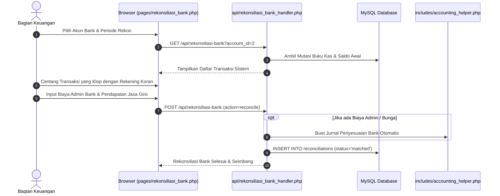

# PRD 12: Modul Tools, Rekonsiliasi Bank & Pemeliharaan Sistem

| Atribut Dokumen | Informasi |
|:---|:---|
| **Modul** | Tools Produktivitas, Rekonsiliasi Bank & Pemeliharaan Sistem |
| **Versi Dokumen** | 2.1.0 |
| **Tanggal Efektif** | 2026-10-02 |
| **Status** | Active / Production Standard |

---

## 1. Ringkasan Eksekutif & Karakteristik Modul

Modul Tools dan Pemeliharaan menyediakan serangkaian utilitas tingkat lanjut untuk menjaga kesehatan sistem, mengotomatisasi pekerjaan rutin akuntansi, memastikan kecocokan antara catatan bank dan buku besar, melacak anomali transaksi melalui audit investigatif, serta memudahkan pengguna mencari informasi melalui mesin pencarian global (*Global Search*).

---

## 2. Fitur-Fitur Utama

### 2.1. Transaksi Berulang (Recurring Templates & Scheduler)
- **Template Transaksi Rutin:** Memungkinkan admin menyimpan pola transaksi yang berulang secara berkala (misal: Biaya Langganan Internet Sekolah, Listrik PLN, Kebersihan, Honorarium Pembina).
- **Frekuensi Terjadwal:** Harian, Mingguan, Bulanan, atau Tahunan.
- **Eksekutor Otomatis (Cron / Scheduled Task):**  
  File [api/run_recurring.php](file:///d:/laragon/www/smkn5-toko/api/run_recurring.php) dapat dipanggil melalui sistem cron server untuk meng-generate transaksi dan jurnal secara otomatis tanpa input manual.

### 2.2. Rekonsiliasi Bank (Bank Reconciliation Engine)
- **Pencocokan Rekening Koran vs Sistem:**  
  Fitur untuk membandingkan mutasi rekening bank fisik dengan akun Kas/Bank di Buku Besar.
- **Pencatatan Selisih Bank:**  
  Mencatat setoran dalam perjalanan (*Deposit in Transit*), cek beredar (*Outstanding Check*), biaya administrasi bank bulanan, dan pendapatan bunga bank.
- **Histori Rekonsiliasi:**  
  Menyimpan riwayat dan bukti audit hasil rekonsiliasi yang telah selesai ditutup per akhir bulan.

### 2.3. Audit Transaksi (Transaction Audit Trail)
- **Investigasi Perubahan Data:** Melacak setiap pengeditan, perubahan harga, atau pembatalan (*void*) nota penjualan.
- **Pendeteksi Anomali:** Menandai transaksi yang memiliki ketidakwajaran (misal: penjualan bernilai Rp 0, potongan diskon tidak wajar, selisih kas fisik mencurigakan).
- **Penyelarasan Integritas:** Mengonfirmasi bahwa setiap transaksi penjualan, pembelian, dan kas memiliki pasangan jurnal umum di `jurnal_entries` dan rekap di `general_ledger`.

### 2.4. Global Search (Pencarian Cepat Seluruh Sistem)
- Kotak pencarian global pada bilah atas (*top bar*) aplikasi.
- Mesin pencari instan via `api/global_search_handler.php` yang secara bersamaan mencari ke dalam:
  - Data Anggota (Nama, NIK, No Anggota).
  - Katalog Barang (Nama Produk, Barcode, SKU).
  - Nomor Transaksi & Faktur (POS, PO, Jurnal).
  - Bagan Akun (Kode Akun, Nama Akun).

### 2.5. Changelog Interaktif Aplikasi
- Antarmuka modern berbasis Tailwind CSS dan efek *glassmorphism* di `/changelog`.
- Mengelompokkan catatan pembaruan berdasarkan versi (misal: v2.0.2, v2.0.1, v2.0.0).
- Fitur *collapsible accordion* dengan indikator berdenyut (*pulsing badge*) pada versi terbaru.

---

## 3. Alur Kerja (Workflow) Rekonsiliasi Bank



---

## 4. Spesifikasi Rute & Endpoint API

| Method | URL Path | Handler File | Hak Akses | Deskripsi |
|:---|:---|:---|:---|:---|
| `GET` | `/transaksi-berulang` | `pages/transaksi_berulang.php` | `auth` | Halaman kelola template transaksi rutin |
| `GET` | `/api/recurring` | `api/recurring_handler.php` | `auth` | Data JSON daftar template transaksi berulang |
| `POST` | `/api/recurring` | `api/recurring_handler.php` | `auth` | Simpan / update / nonaktifkan template rutin |
| `GET/POST`| `/api/run-recurring` | `api/run_recurring.php` | Whitelist Cron | Script eksekutor otomatis transaksi berulang |
| `GET` | `/rekonsiliasi-bank` | `pages/rekonsiliasi_bank.php` | `auth` | Halaman kerja rekonsiliasi mutasi bank |
| `GET` | `/api/rekonsiliasi-bank`| `api/rekonsiliasi_bank_handler.php` | `auth` | Data perbandingan rekening vs buku besar |
| `POST` | `/api/rekonsiliasi-bank`| `api/rekonsiliasi_bank_handler.php` | `auth` | Simpan hasil pencocokan rekonsiliasi |
| `GET` | `/histori-rekonsiliasi` | `pages/histori_rekonsiliasi.php` | `auth` | Histori arsip rekonsiliasi bank |
| `GET` | `/audit-transaksi` | `pages/audit_transaksi.php` | `auth` | Halaman investigasi log audit transaksi |
| `GET` | `/api/audit-transaksi` | `api/audit_transaksi_handler.php` | `auth` | Data JSON anomali transaksi dan integritas |
| `GET` | `/api/global-search` | `api/global_search_handler.php` | `auth` | Endpoint pencarian global lintas modul |
| `GET` | `/changelog` | `pages/changelog.php` | `auth` | Tampilan catatan rilis dan pembaruan |

---

## 5. Struktur Basis Data (Data Model)

### 5.1. Tabel `recurring_templates`
```sql
CREATE TABLE `recurring_templates` (
  `id` int(11) NOT NULL AUTO_INCREMENT,
  `user_id` int(11) NOT NULL,
  `nama_template` varchar(100) NOT NULL,
  `jenis` enum('pemasukan','pengeluaran','jurnal') NOT NULL,
  `account_id` int(11) NOT NULL,
  `kas_account_id` int(11) DEFAULT NULL,
  `jumlah` decimal(15,2) NOT NULL,
  `frekuensi` enum('harian','mingguan','bulanan','tahunan') NOT NULL DEFAULT 'bulanan',
  `hari_eksekusi` int(11) NOT NULL DEFAULT 1,
  `terakhir_dijalankan` date DEFAULT NULL,
  `status` enum('aktif','nonaktif') NOT NULL DEFAULT 'aktif',
  `created_at` timestamp NOT NULL DEFAULT current_timestamp(),
  PRIMARY KEY (`id`)
) ENGINE=InnoDB DEFAULT CHARSET=utf8mb4;
```

### 5.2. Tabel `reconciliations`
```sql
CREATE TABLE `reconciliations` (
  `id` int(11) NOT NULL AUTO_INCREMENT,
  `user_id` int(11) NOT NULL,
  `account_id` int(11) NOT NULL,
  `tanggal_rekon` date NOT NULL,
  `saldo_rekening_koran` decimal(15,2) NOT NULL,
  `saldo_buku_besar` decimal(15,2) NOT NULL,
  `selisih` decimal(15,2) NOT NULL DEFAULT 0.00,
  `status` enum('seimbang','selisih') NOT NULL DEFAULT 'seimbang',
  `catatan` text DEFAULT NULL,
  `created_by` int(11) DEFAULT NULL,
  `created_at` timestamp NOT NULL DEFAULT current_timestamp(),
  PRIMARY KEY (`id`),
  KEY `account_id` (`account_id`)
) ENGINE=InnoDB DEFAULT CHARSET=utf8mb4;
```

---

## 6. Standar Keamanan & Pemeliharaan Skrip

1. **Proteksi Endpoint Cron (`run_recurring.php`):**
   Meskipun di-whitelist dari proteksi CSRF di [includes/bootstrap.php](file:///d:/laragon/www/smkn5-toko/includes/bootstrap.php), endpoint cron ini hanya boleh diakses melalui CLI (`php api/run_recurring.php`) atau dilengkapi dengan token rahasia (*secret token*) jika dipicu melalui HTTP request.
2. **Defensive Coding & Pemeliharaan Cache:**
   Setiap script pemeliharaan (seperti `syn_stok.php` atau rekonsiliasi data) beroperasi di bawah transaksi database terkunci (`LOCK TABLES` atau `START TRANSACTION`) agar integritas saldo akhir tidak terpengaruh oleh operasi kasir yang berlangsung bersamaan.
3. **Pemberitahuan Versi Baru:**
   Pengembang yang merilis versi baru wajib mendokumentasikan poin pembaruan pada [CHANGELOG.md](file:///d:/laragon/www/smkn5-toko/CHANGELOG.md) dan memperbarui nomor versi aplikasi pada `config/settings`.
